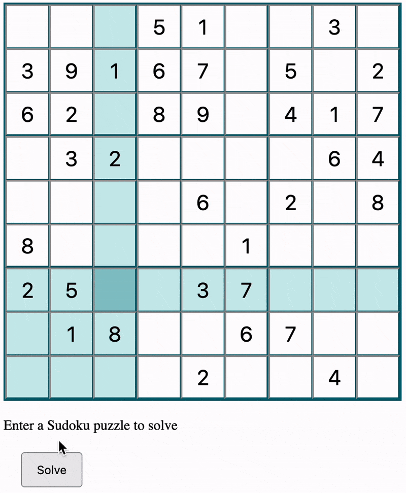

# Sudoku Solver
A web-based application to solve Sudoku puzzles. Users can input their Sudoku puzzle, and the solver will fill in the grid with a valid solution using backtracking algorithm.

## Features
- **Interactive Grid:** Users can input numbers into a 9x9 Sudoku grid.
- **Validation:** Checks for input validity and highlights incorrect entries.
- **Highlighting:** Highlights the row, column, and box of the selected cell for ease of input.

## How to Use
- **Input Puzzle:** Enter your Sudoku puzzle into the grid. Each cell accepts a single digit.
- **Solve:** Click the 'Solve' button to find a solution.
- **Invalid Inputs:** If invalid inputs are detected, the application will prompt for correction.

## Technologies Used
- HTML
- CSS
- JavaScript

## File Structure
- `index.html` - Main HTML file for the Sudoku solver.
- `styles.css` - Styling for the Sudoku grid and elements.
- `scripts.js` - JavaScript code for Sudoku grid creation, input handling, backtracking solving algorithm, and user interactions.

## Demonstration

